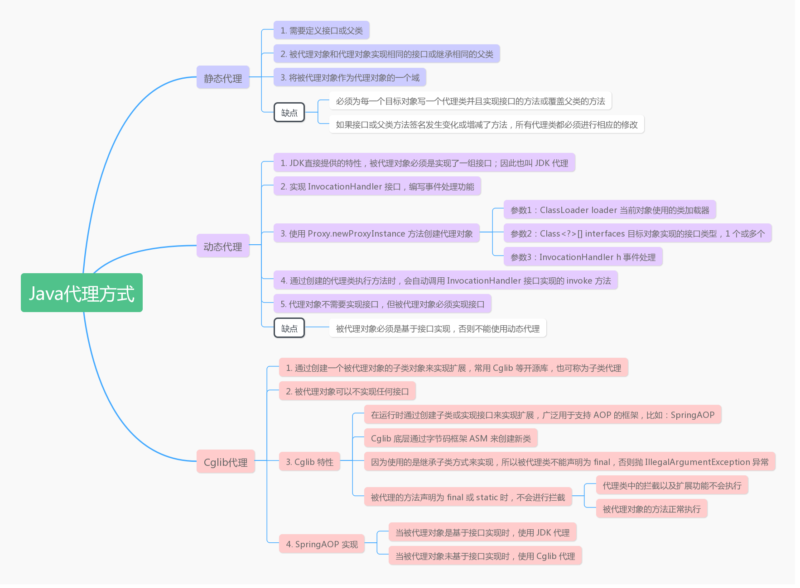

# Java 三种代理方式和Spring AOP/MyBatis Mapper应用

**Java 三种代理方式总结**

如果你对 JDK 源码、Spring/MyBatis框架源码分析感兴趣。可以关注我的公众号【开发圈DevOps】，搜索 DevCircle 或扫描下边二维码进行关注。

【开发圈DevOps】是一个软件开发交流社区，以Java技术栈为主，覆盖产品、设计、大前端、后端、中台、DevOps等。

**公众号内容：**

- 开发技术分享
- 工作经验及职业规划
- 行业趋势观点

*注：公众号刚开始做，内容不太多，保持每周1、2篇。*